# Formfeed templates

Free document templates under the MIT license: invoices, quotes, delivery notes, reminders, credit
notes, certificates, payslips, timesheets, tickets, name badges, vouchers, reports, social images and
shipping labels. Each is plain HTML and CSS with Jinja2, Liquid or Handlebars tags, together with the
sample data it was designed with and the PDF or image it renders to.

30 templates and 20 building blocks. Every template renders on
[Formfeed](https://formfeed.dev/?utm_source=github-templates), where each has its own page with the
API call in eight languages.

## Use a template

Every template's README has a **Use this template** link: it opens the template in Formfeed, where
one click puts a copy into your workspace, published and ready for the API. A free account is
enough. Or take the files:

1. **Copy it.** A folder under `templates/` holds `template.html`, its stylesheet and settings, and
   `data/default.json`. The tags are ordinary Jinja2, Liquid or Handlebars; the helpers they call
   (money, dates, QR codes and GiroCodes, barcodes, charts) are described in the
   [helper reference](https://docs.formfeed.dev/templates/helpers).
2. **Push it into Formfeed.** This repository is a Formfeed project (`formfeed.json`), so the CLI
   works in it as it is:

   ```sh
   git clone https://github.com/formfeed-dev/templates
   cd templates
   npx formfeed login
   npx formfeed templates push invoice-de
   ```

   Then change it in the editor, whose preview paginates like the PDF, and render it from your
   code: the [API](https://docs.formfeed.dev/api/overview), the SDKs for TypeScript and Python, or
   Zapier, Make and n8n.
3. **Check it offline.** `npx formfeed validate` compiles every template with its own sample data
   and reports unknown variables and filters. No account needed.

## Templates

### Quotes, invoices and what follows them

| | Template | |
| --- | --- | --- |
| 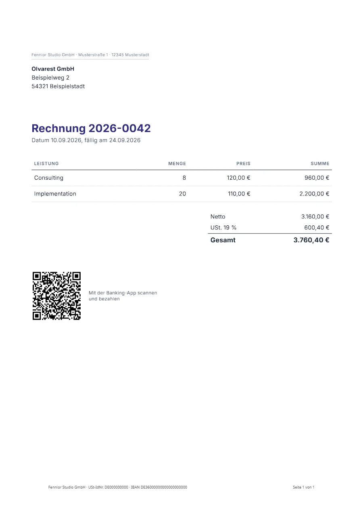 | **[German invoice with GiroCode](templates/invoice-de)**<br>Line items, net, VAT and gross computed in the template, dates in German format with a due date 14 days out, a SEPA QR code banking apps scan, and a running footer with page numbers. Your code sends the facts; the template owns the legal layout. | Jinja2 · PDF |
| 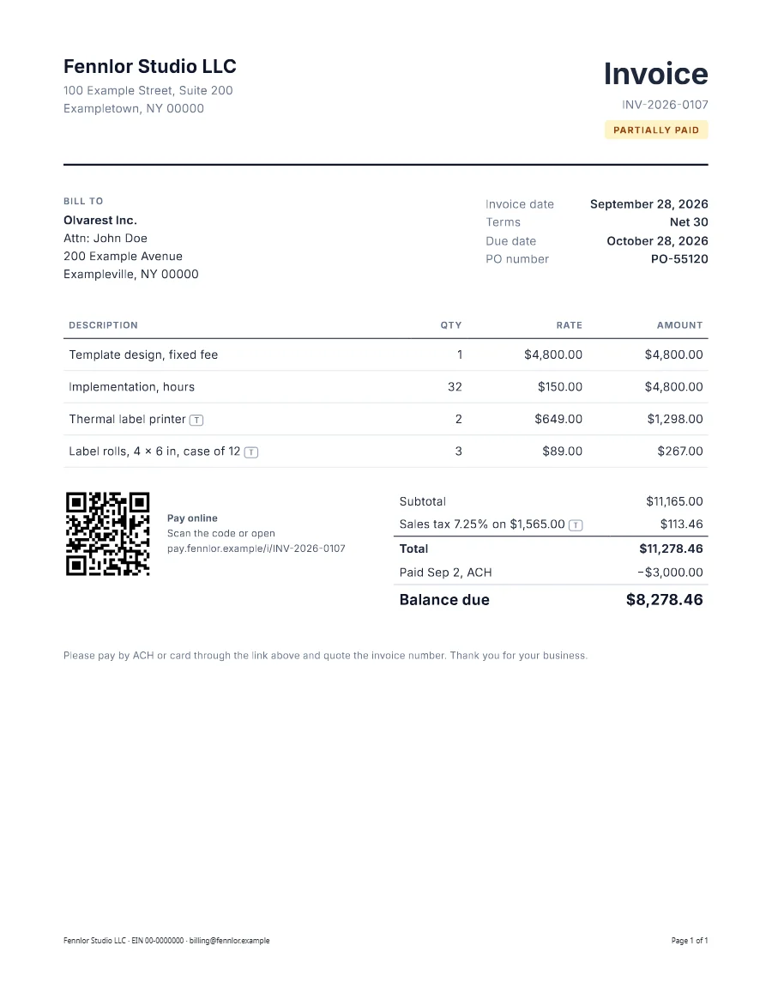 | **[US invoice with sales tax](templates/invoice-us)**<br>Letter paper, dollars and US dates from the template’s `en-US` locale. Sales tax applies only to the lines marked taxable, a deposit reduces the balance, the status badge and the pay-online QR code follow from what is left to pay. | Jinja2 · PDF |
| 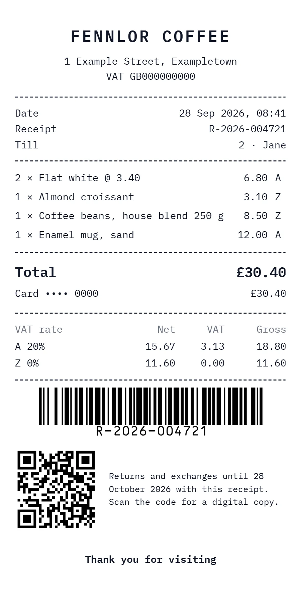 | **[Till receipt on an 80 mm roll](templates/receipt)**<br>A receipt for thermal printers whose page is exactly as long as the receipt: the template writes its own `@page` size from the number of items and VAT rates. Prices include VAT, and the VAT analysis per rate is worked out in the template with `where` and `sum`. | Liquid · PDF |
| 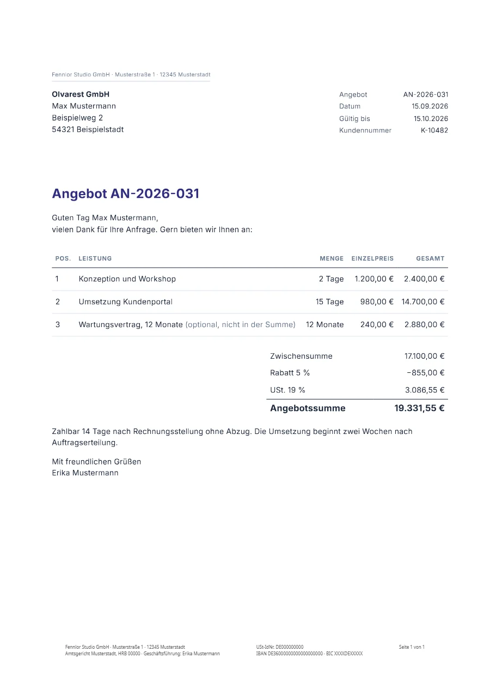 | **[German quote (Angebot) with optional items](templates/angebot)**<br>A quote in the German letter layout: optional positions are listed but stay out of the sum, the discount and VAT are computed in the template, and the validity date follows from the quote date. The footer carries the company details German law expects on business letters. | Jinja2 · PDF |
| 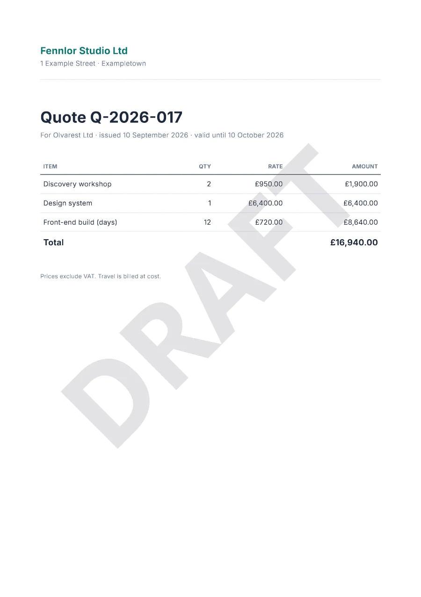 | **[Quote marked as a draft](templates/quote)**<br>The template knows nothing about the mark: `post.watermark` stamps DRAFT across every page after the render, so the reviewed draft and the final quote come from the same template and data. The text is sized to the page diagonal and runs from bottom left to top right. Half a unit on top of the render; `/pdf/watermark` marks a PDF you rendered earlier. | Liquid · PDF |
| 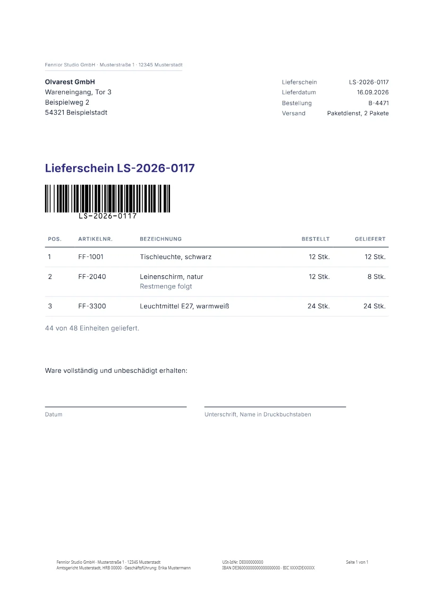 | **[German delivery note (Lieferschein)](templates/lieferschein)**<br>A delivery note without prices: ordered against delivered quantities, a note on lines with a remainder to follow, the number as a Code 128 barcode for goods receipt, and a signature block that never splits across pages. Written in Liquid. | Liquid · PDF |
| 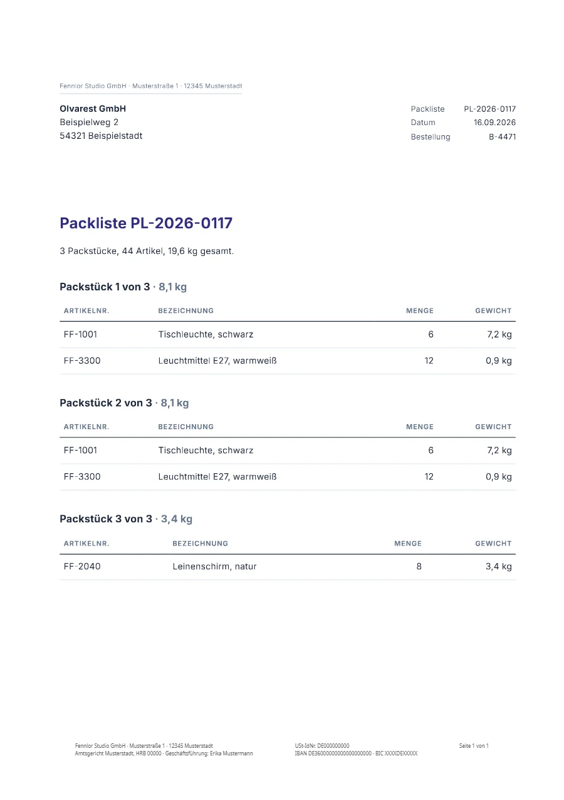 | **[German packing list (Packliste) grouped by package](templates/packliste)**<br>The request sends one flat list of items; `groupBy` turns it into a section per package with its own table and weight, and the opening line counts packages, items and kilograms. A package never splits across two pages. | Jinja2 · PDF |
| 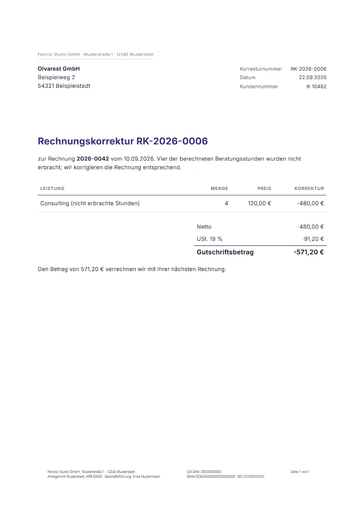 | **[German invoice correction (Rechnungskorrektur)](templates/rechnungskorrektur)**<br>What is commonly called a “Gutschrift”: a correction that refers to the original invoice by number and date and shows the amounts as negatives. The data holds the positive values of the corrected lines; the template turns the sign with `multiply(-1)` and computes VAT on the result. | Jinja2 · PDF |
| 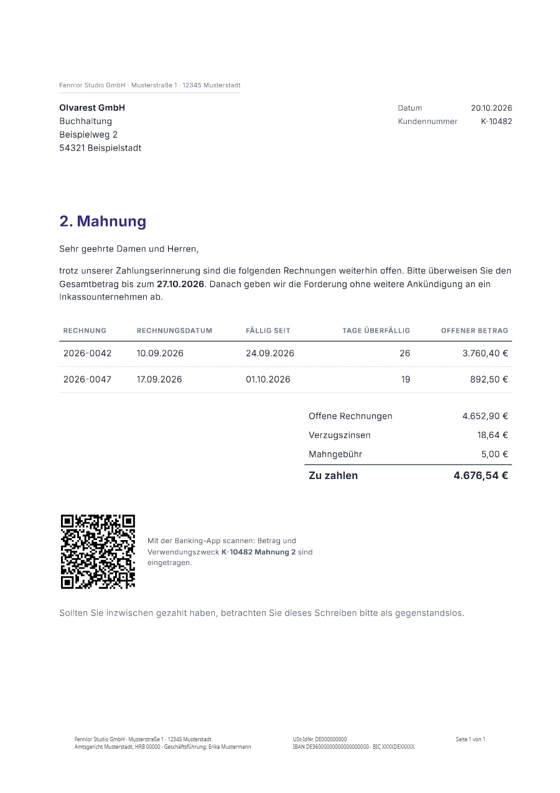 | **[German payment reminder (Mahnung) with GiroCode](templates/mahnung)**<br>A dunning letter in Handlebars: the wording changes with the final notice, open invoices are summed with interest and the reminder fee through nested helpers, and a GiroCode carries the total and the payment reference. The dunning run for all customers is one batch. | Handlebars · PDF |

### Certificates and HR documents

| | Template | |
| --- | --- | --- |
| 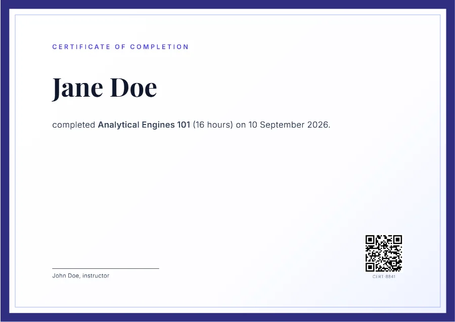 | **[Course certificate in Handlebars](templates/certificate)**<br>A landscape certificate with a verification QR code, rendered one at a time as PNG or for a whole course as a batch that ends in a zip. Handlebars takes options as hash arguments: `{{qrcode verify_url size=96}}`. | Handlebars · PDF |
| 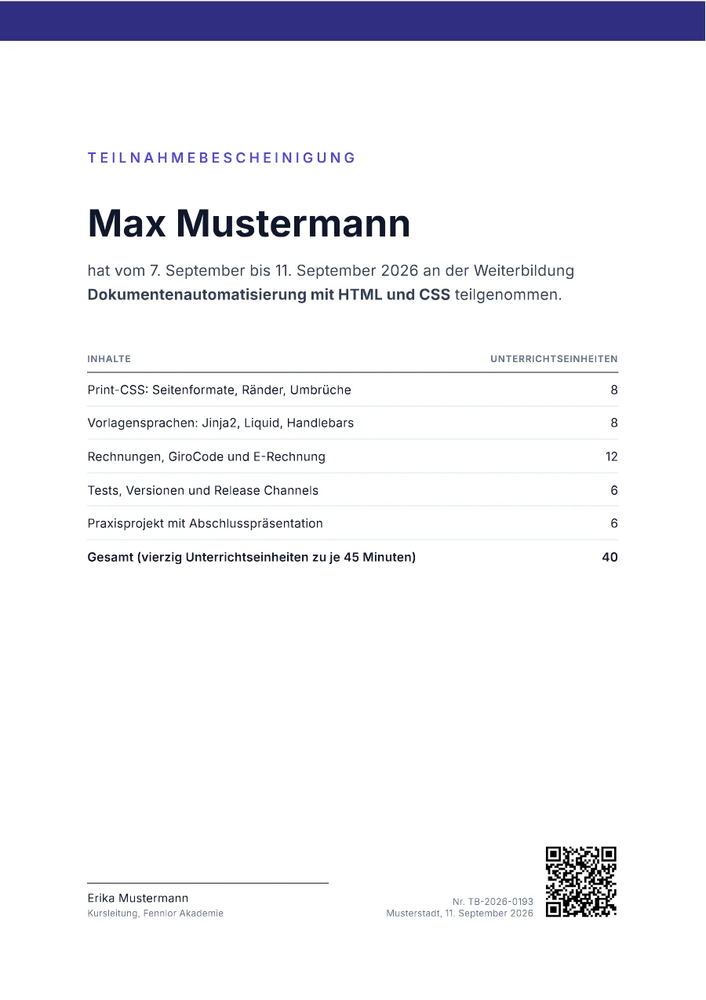 | **[German certificate of attendance (Teilnahmebescheinigung)](templates/teilnahmebescheinigung)**<br>A certificate that lists what was taught: the course modules with their teaching units, the total as a number and spelled out in German by `numToWords`, and a QR code to verify the certificate number. Full-bleed A4 with zero margins, rendered for a whole course as one batch. | Handlebars · PDF |
| 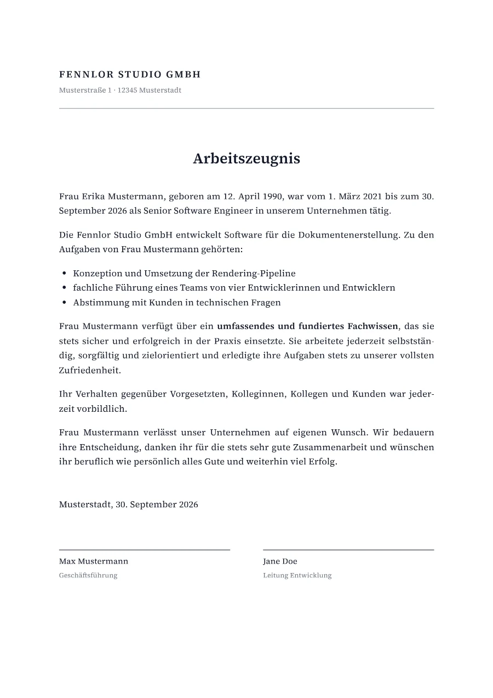 | **[German reference letter (Arbeitszeugnis) from Markdown](templates/arbeitszeugnis)**<br>A text document rather than a table: the paragraphs arrive as Markdown, `markdown` turns them into HTML with lists and emphasis, and the template sets a serif face, justified text with hyphenation and a signature block for two signers that stays together on one page. | Liquid · PDF |
| 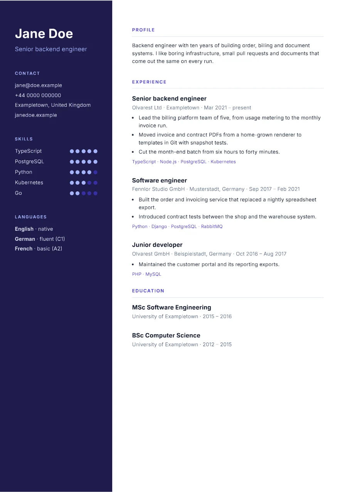 | **[Résumé with a sidebar and skill ratings](templates/resume)**<br>A one-page CV in two columns, full bleed. The template sorts the positions by start date, so the data can arrive in any order, writes “present” for a job without an end date, and draws each skill rating as five dots with `range` and `lt`. | Handlebars · PDF |
| 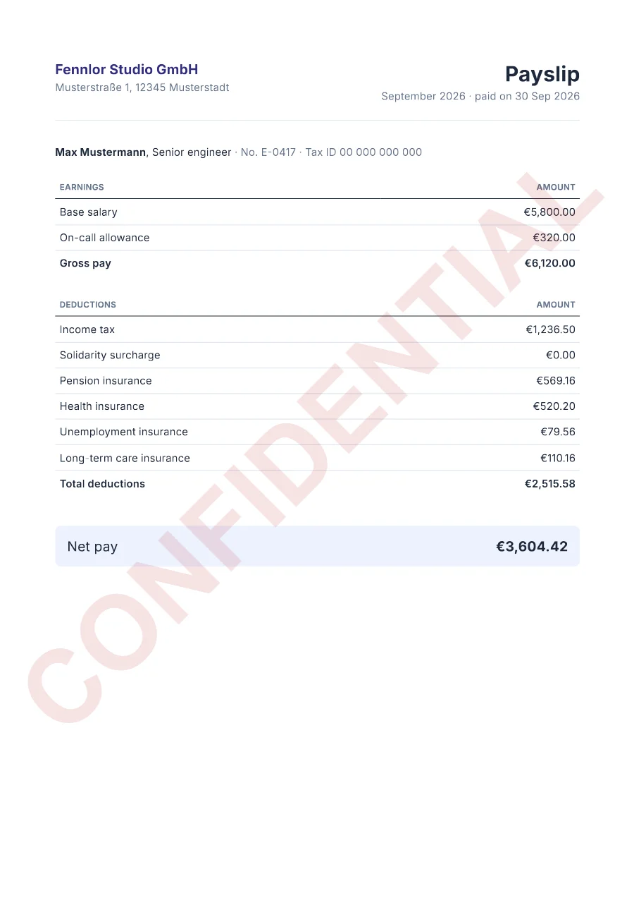 | **[Confidential payslip with a password](templates/payslip)**<br>Two post-processing steps in one request: a red CONFIDENTIAL mark on every page, then AES-256 encryption with the employee’s password, allowing printing but not copying or editing. The password never reaches the render log. The download opens with the password `formfeed`. One unit for the page plus half a unit per step. | Handlebars · PDF |
| 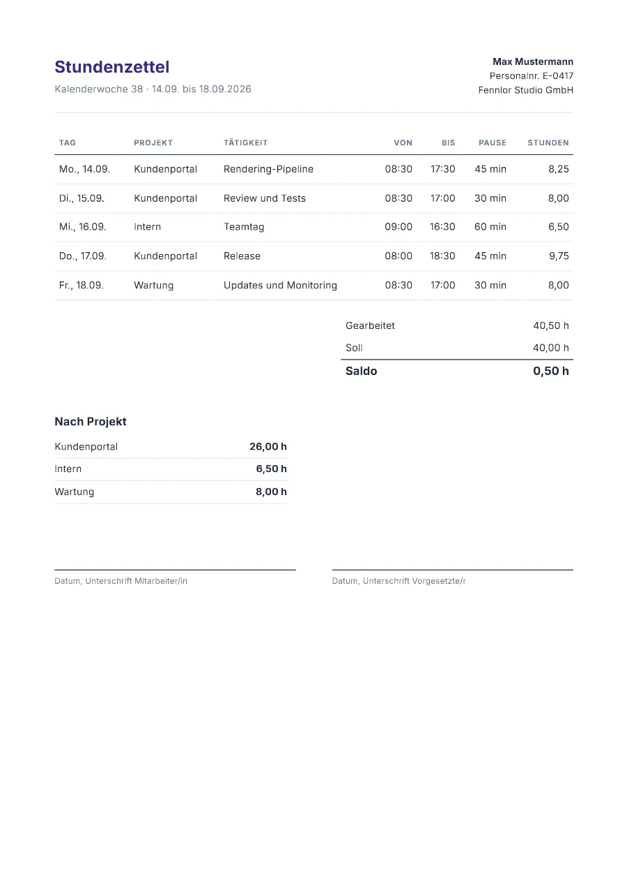 | **[German timesheet (Stundenzettel) with balance and projects](templates/stundenzettel)**<br>A weekly timesheet in Handlebars: weekdays formatted in German, worked hours summed and set against the target with `subtract`, and the same entries grouped by project for the summary. Two signature lines stay together at the foot of the page. | Handlebars · PDF |

### Contracts and confirmations

| | Template | |
| --- | --- | --- |
| 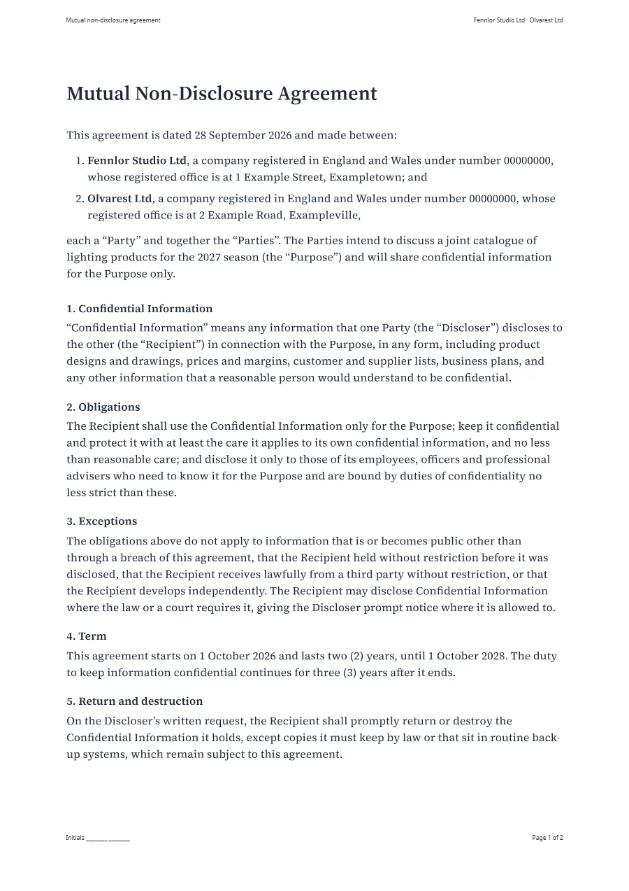 | **[Mutual NDA with numbered clauses](templates/mutual-nda)**<br>A two-page agreement with a running header, a footer for initials and page numbers, and clauses numbered by CSS counters, so the optional non-solicitation clause renumbers everything after it. The term is written out with `numToWords`: “two (2) years”. | Handlebars · PDF |
| 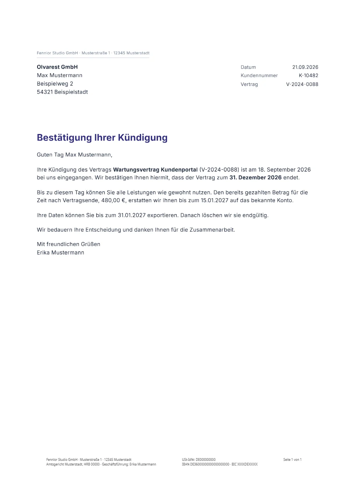 | **[German cancellation confirmation (Kündigungsbestätigung)](templates/kuendigungsbestaetigung)**<br>A plain business letter whose paragraphs depend on the data: with a refund it names the amount and the date, without one it says that nothing is open, and the data export paragraph appears only when there is a deadline. Dates are written out in German. | Handlebars · PDF |
| 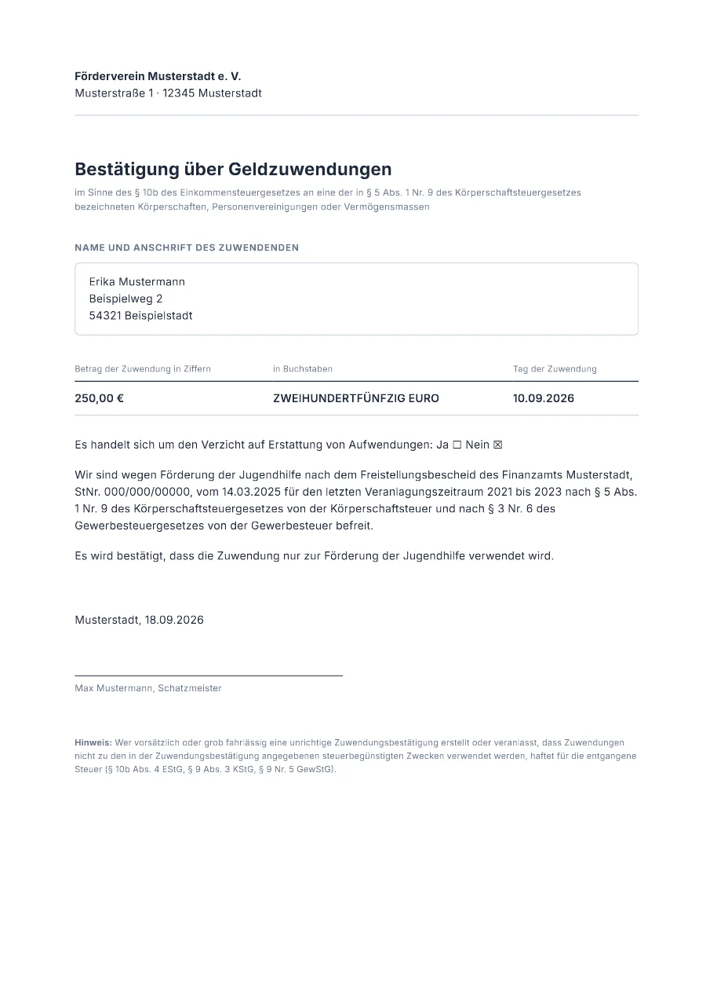 | **[German donation receipt (Spendenbescheinigung)](templates/spendenbescheinigung)**<br>A receipt for a monetary donation laid out after the wording of the official German sample: the amount in figures and, through `numToWords`, in capital letters as the form asks, the exemption notice of the tax office, and the liability note. It shows the mechanics; have your tax adviser check the wording for your organisation. | Liquid · PDF |

### Events: tickets, badges and vouchers

| | Template | |
| --- | --- | --- |
| 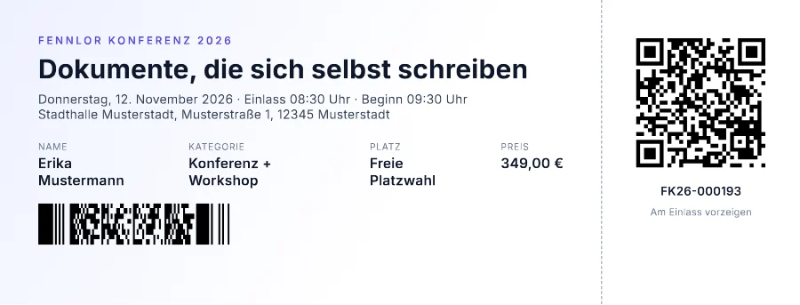 | **[Event ticket with QR code and PDF417](templates/ticket)**<br>A print-at-home ticket on its own paper size, 210 × 80 mm without margins: a QR code for the check-in app on the stub, the ticket number again as a PDF417 strip for hand scanners, and the start time, doors and weekday formatted in German from two timestamps. | Jinja2 · PDF |
|  | **[Name badges, eight per A4 sheet](templates/namensschilder)**<br>One request carries the whole guest list. `chunk(8)` cuts it into sheets of eight badges in a CSS grid of 90 × 67.5 mm cells, `pageBreak()` starts a new sheet between them, and `default` fills in a missing organisation or role. Ten guests give two pages. | Jinja2 · PDF |
| 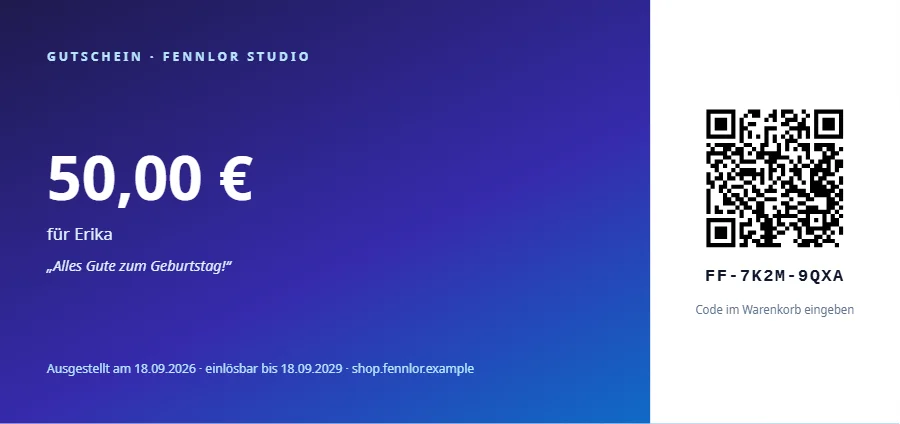 | **[Gift voucher with Tailwind, as PDF and PNG](templates/gutschein)**<br>A voucher in the DIN long format, styled with Tailwind classes that are compiled at render time, arbitrary values such as `h-[99mm]` included. The expiry date is three years after the issue date through `dateAdd`, the message appears only when there is one, and the same template renders as a PNG for the mail. | Liquid · PDF |

### Reports, price lists and multilingual documents

| | Template | |
| --- | --- | --- |
| 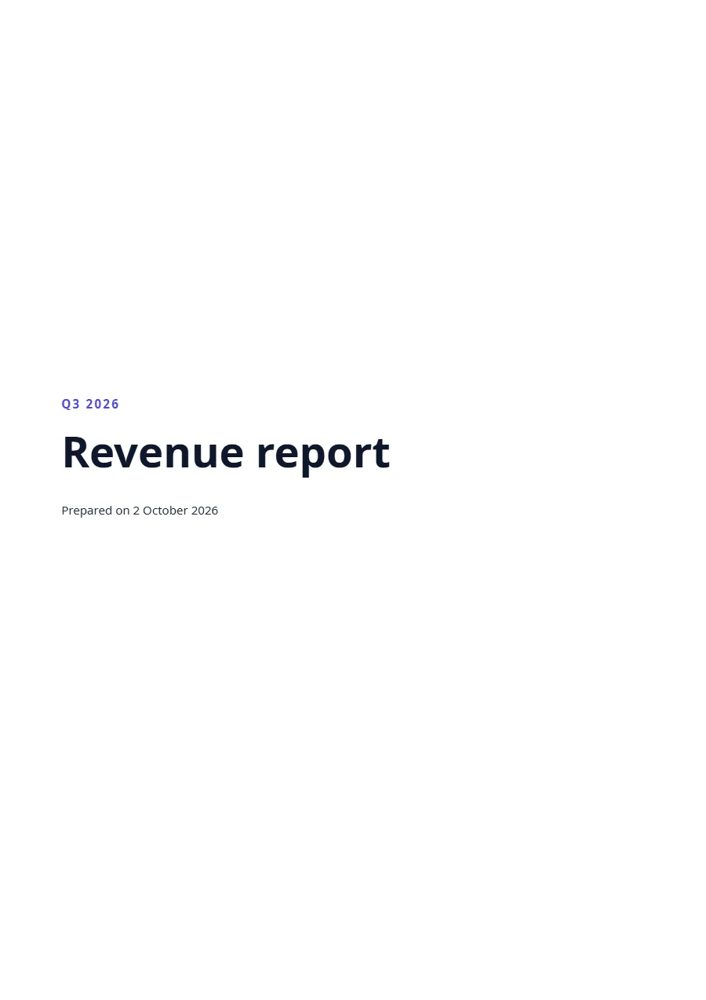 | **[Report with a chart](templates/revenue-report)**<br>A cover page, a page break and a Chart.js bar chart built from the data inside the template, with `pluck` pulling the labels and values out of the rows. Charts render without animation, so the PDF matches the preview. Long reports go async and report back through a webhook. | Jinja2 · PDF |
| 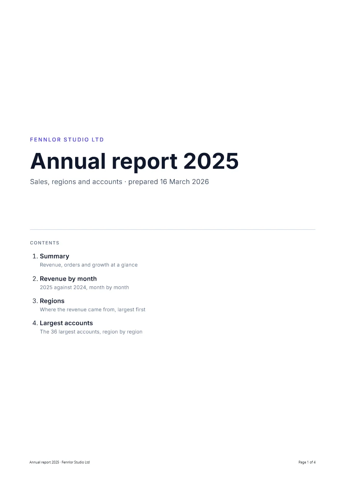 | **[Annual report with contents and bookmarks](templates/annual-report)**<br>A four-page report: a cover with a linked table of contents, KPI cards, a line chart comparing two years, regions sorted by revenue and an appendix of accounts grouped by region. `pdf.outline` turns the headings into bookmarks, and no region is split across a page. | Jinja2 · PDF |
| 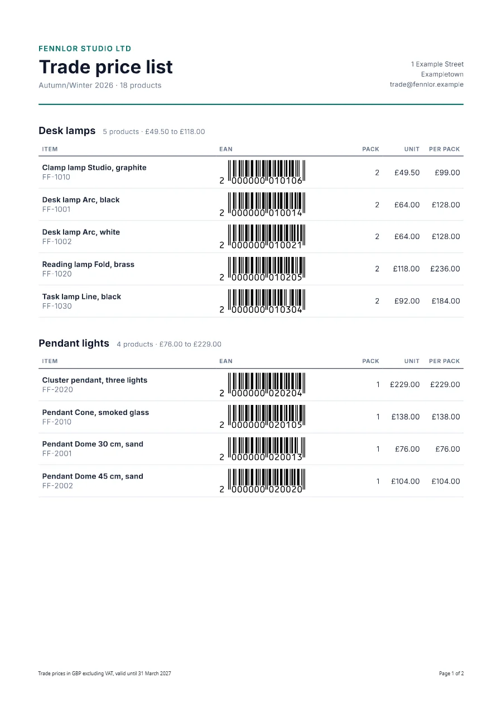 | **[Trade price list with EAN barcodes](templates/price-list)**<br>A product feed goes in unsorted. `groupBy` makes a section per category, `sortBy` orders each by name, `min` and `max` give the price range in the heading, and every row carries its EAN-13 barcode. A category never breaks across a page. | Liquid · PDF |
|  | **[One template, many languages](templates/order-confirmation)**<br>Texts come from the template’s dictionary through `t()`, and the request’s `locale` picks the language and the number and date formats. The German render says “Auftragsbestätigung” and “113,50 €”, the English one “Order confirmation” and “€113.50”, from the same data. | Jinja2 · PDF |

### Social images and labels

| | Template | |
| --- | --- | --- |
|  | **[Open Graph image with Tailwind](templates/og-image)**<br>A 1200×630 social image in Liquid with Tailwind classes, compiled at render time. Liquid passes options as keyword arguments (`| image: width: 72`), and identical requests are served from the dedup cache at zero units. | Liquid · image |
| 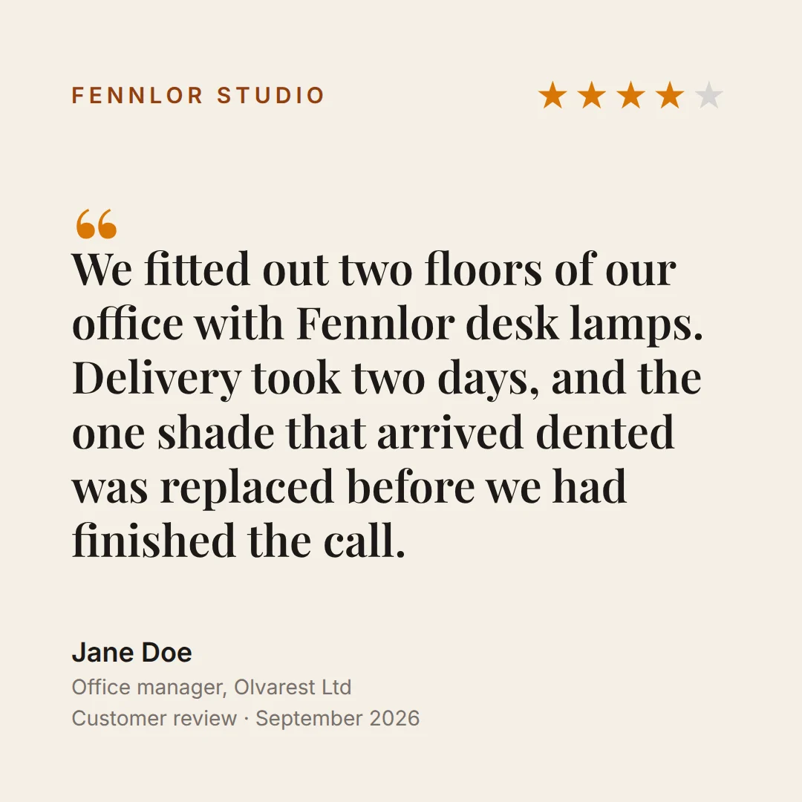 | **[Review card, 1080×1080](templates/review-card)**<br>A square card for Instagram and LinkedIn from one customer review: `range` and `lt` draw the rating as five stars, `truncate` keeps a long quote inside the square, and the date of the review is written out as month and year. | Handlebars · image |
| 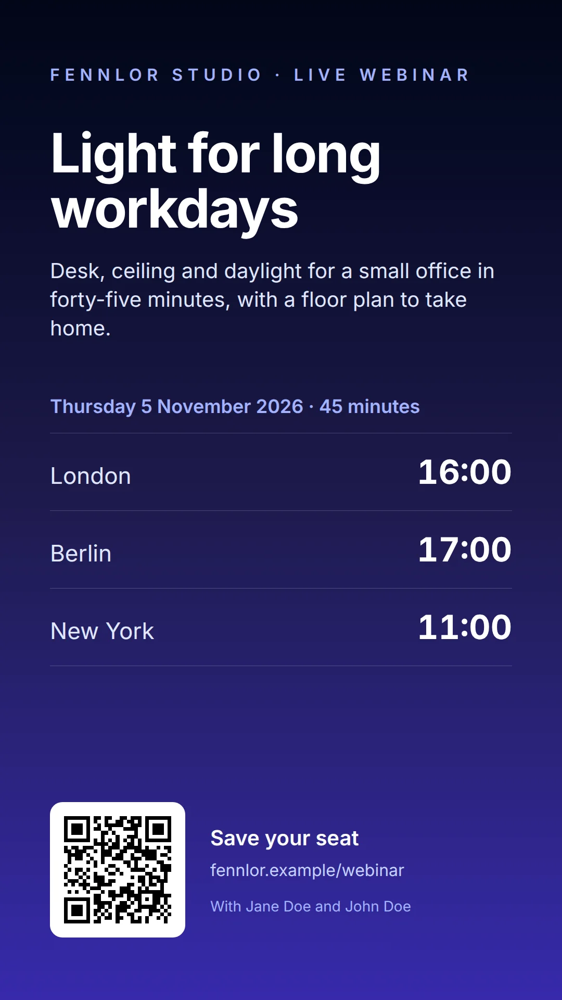 | **[Webinar story, 1080×1920](templates/event-story)**<br>A 9:16 story in Liquid and Tailwind that gives the start time in three cities from one timestamp: `date` takes a time zone as its second argument, so London, Berlin and New York each read their own clock, winter time included. | Liquid · image |
| 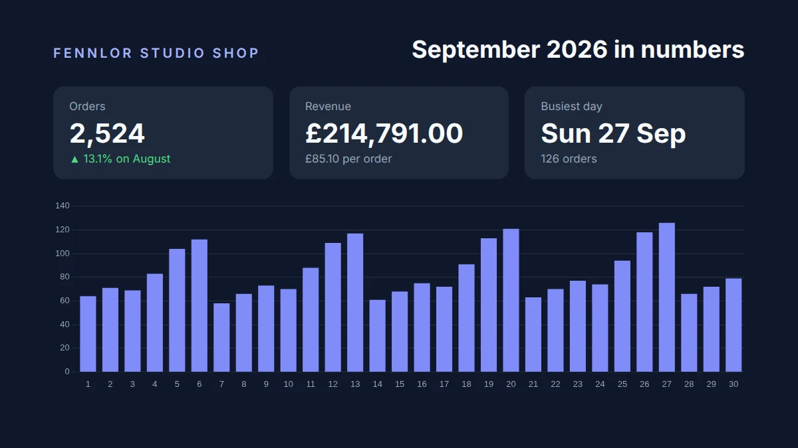 | **[Metrics card with a chart, 1200×675](templates/metrics-card)**<br>A 16:9 card for Slack, LinkedIn or X from thirty days of orders: totals, the change on the month before, the busiest day found with `sortBy` and `first`, and a Chart.js bar chart styled for a dark background, all computed in the template. | Jinja2 · image |
| 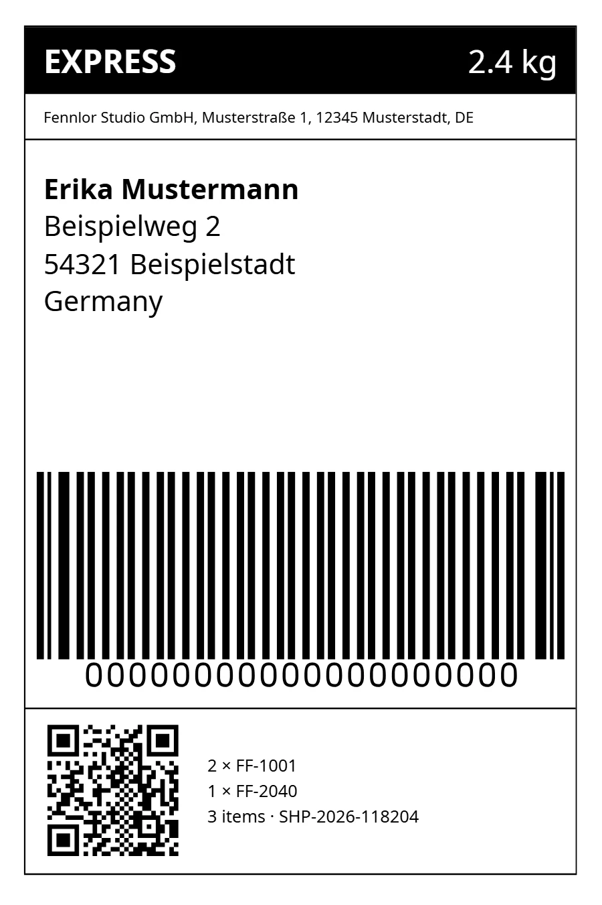 | **[Shipping label, 100×150 mm](templates/shipping-label)**<br>A custom paper size for thermal printers, a Code 128 tracking barcode, a QR code built from a URL and the tracking number, and the package contents summed in the template. `barcode` also does EAN-13, ITF-14, DataMatrix and PDF417. | Jinja2 · PDF |

## Building blocks

Smaller pieces for your own templates, each in all three dialects: a letterhead, an address window,
an invoice table with totals, payment terms, a GiroCode, a signature line, page breaks, key figures
and a chart. In the Formfeed editor each is one click in the blocks panel.

### Letter

- [Letterhead](blocks/letterhead.md): Logo from the brand kit, or the organisation name when no logo is set.
- [Window envelope address](blocks/window-address.md): Return address and recipient in the 85 × 45 mm field of a DIN 5008 window envelope.
- [Reference block](blocks/reference-block.md): Customer number, invoice number and date as a right-aligned table; put it in a two-column layout to sit beside the address.
- [Address block](blocks/address-block.md): Recipient name and postal address lines.
- [Signature line](blocks/signature.md): Place, date and a signature line.

### Invoice and payment

- [Invoice heading](blocks/invoice-heading.md): Invoice number as the title and the service period below it.
- [Invoice table](blocks/invoice-table.md): Line items with description, quantity, unit price and line total.
- [Totals block](blocks/totals.md): Net, VAT and gross totals right-aligned under a table.
- [Payment terms and bank details](blocks/payment-terms.md): Amount, due date and the account to transfer it to.
- [Small business VAT note](blocks/small-business-note.md): States that no VAT is charged under § 19 UStG (Kleinunternehmerregelung).
- [Reverse charge note](blocks/reverse-charge-note.md): EU business customers: the recipient owes the VAT, with their VAT ID.
- [SEPA payment QR code](blocks/epc-qr.md): GiroCode that banking apps scan to prefill the transfer.

### Page and layout

- [Footer with page numbers](blocks/page-footer.md): Company line and “Page x of y” in the page footer.
- [Legal footer](blocks/legal-footer.md): The legal footer from the brand kit, centred in the page footer.
- [Two-column layout](blocks/two-columns.md): Two equal columns that stay side by side in print.
- [Keep together](blocks/keep-together.md): Content that is never split across two pages.
- [Page break](blocks/page-break.md): Starts a new page in the PDF.

### Report

- [Cover page](blocks/cover-page.md): Title, subtitle and date on a page of its own.
- [Chart](blocks/chart.md): Bar chart from labels and values in the data, in the brand colour.
- [Key figures](blocks/kpi-cards.md): A row of cards with label, value and change for each figure.

## Contributing

New templates and fixes are welcome; see [CONTRIBUTING.md](CONTRIBUTING.md).

## License

MIT, see [LICENSE](LICENSE). Use the templates in any project, with Formfeed or without it.
