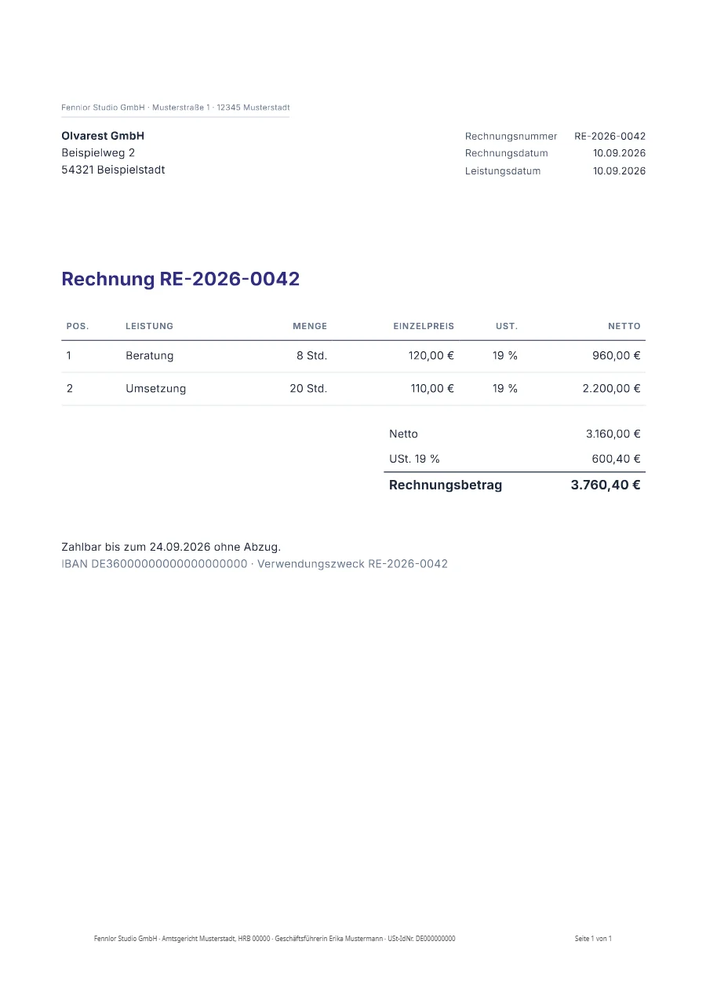

# E-invoice: ZUGFeRD and Factur-X from one template

A German invoice whose data is one `_invoice` block. The template prints the block, and the same block becomes the XML inside the PDF: a ZUGFeRD / Factur-X invoice, a PDF/A-3 that carries `factur-x.xml`, validated against the rules of EN 16931 before it is delivered.

**Engine:** Jinja2 · **Output:** PDF · **Helpers:** `money`, `number`, `date`

[See it on formfeed.dev](https://formfeed.dev/examples/e-invoice?utm_source=github-templates&utm_content=e-rechnung) · [example.pdf](example.pdf)

## What this shows

- `settings.json` declares `einvoice` with the profile `en16931`, so every render of this template is an e-invoice: a PDF/A-3 with the invoice attached as `factur-x.xml`. The request is the one of any other template.
- `settings.json` also declares `pdf.ua`, so the same file is a PDF/UA-1 document: tagged, repaired, and held to the machine-checkable rules of PDF/UA-1 after it became the PDF/A-3. The render carries that verdict as `accessibility` beside `einvoice`, and the two small tables use `th scope="row"`, which is what makes them tables for a screen reader.
- The data is one `_invoice` block and the template prints from it: number, parties, lines, the VAT breakdown and the totals are stated once and end up on the page and in the XML.
- Units and VAT categories are codes in the data (`HUR`, `S`), as the standard wants them; the template turns `HUR` into `Std.` for the reader, and `money` prints `3.760,40 €` from `3760.4`.
- Before the file is delivered, the XML is held to the rules of EN 16931 and the PDF to PDF/A-3b, and the render answers with the report in `einvoice.validation`. A total that does not add up fails the request with `einvoice_data_invalid` and names the rule it breaks.
- The text of the finished PDF is then compared with the XML: a number or total the page does not show is listed in `einvoice.display.missing`, because the XML is the invoice and the page must not say something else.
- E-invoices are part of the Starter plan and above and add one unit to the render; on the Free plan the request is answered with `403`. Formfeed creates and validates the file; sending and archiving it stay with you.

## Files

| File | What it is |
| --- | --- |
| [`template.html`](template.html) | the template |
| [`style.css`](style.css) | its stylesheet |
| [`head.html`](head.html) | extra `<head>` content, such as a font link |
| [`footer.html`](footer.html) | the running footer of every PDF page |
| [`settings.json`](settings.json) | paper, margins and output settings |
| [`data/default.json`](data/default.json) | the sample data it was designed with |
| [`template.json`](template.json) | name, kind and engine, which `formfeed templates push` needs |

## Use it

- **Open it in a workspace.** [Use this template](https://app.formfeed.dev/en/examples/e-invoice?utm_source=github-templates&utm_content=e-rechnung) puts a copy into your Formfeed workspace, published and ready for the API. A free account is enough, and it needs no CLI.
- **Copy it.** It is plain HTML and CSS with Jinja2 tags. The helpers (`money`, `number`, `date`) are Formfeed's; the [helper reference](https://docs.formfeed.dev/templates/helpers) says what each does.
- **Push it into a Formfeed workspace** from the root of this repository, where `formfeed.json` is: `npx formfeed login`, then `npx formfeed templates push e-rechnung`. Open it in the editor to change it with a live preview.
- **Render it** from your code with the [API](https://docs.formfeed.dev/api/overview) and your own data, or try it first with `npx formfeed render e-rechnung`: renders with a test key are free.

MIT licensed, like the rest of this repository. [Formfeed](https://formfeed.dev/?utm_source=github-templates&utm_content=e-rechnung) is a PDF and image generation API with a free plan: 100 units a month, no card.
