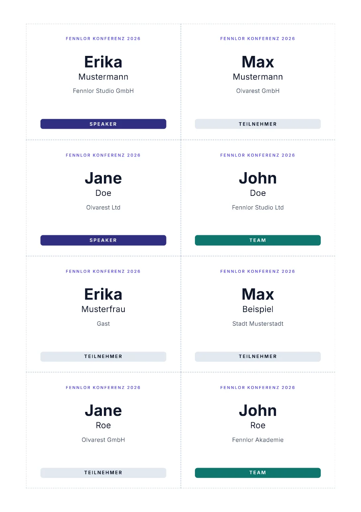

# Name badges, eight per A4 sheet

One request carries the whole guest list. `chunk(8)` cuts it into sheets of eight badges in a CSS grid of 90 × 67.5 mm cells, `pageBreak()` starts a new sheet between them, and `default` fills in a missing organisation or role. Ten guests give two pages.

**Engine:** Jinja2 · **Output:** PDF · **Helpers:** `chunk`, `pageBreak`, `upper`, `default`

[See it on formfeed.dev](https://formfeed.dev/examples/namensschilder?utm_source=github-templates&utm_content=namensschilder) · [example.pdf](example.pdf)

## What this shows

- `attendees | chunk(8)` cuts the list into sheets; ten guests give two pages, the second with two badges.
- A sheet is a CSS grid of two columns of `90mm` and rows of `67.5mm`, which fills the printable height of A4 exactly with four rows.
- `{{ pageBreak() }}` breaks between sheets but leaves no empty page at the end.
- `default('Gast')` and `default('teilnehmer')` fill a missing organisation or role, and the role doubles as a CSS class for the coloured bar.
- The dashed hairline around each badge is the cutting guide.

## Files

| File | What it is |
| --- | --- |
| [`template.html`](template.html) | the template |
| [`style.css`](style.css) | its stylesheet |
| [`head.html`](head.html) | extra `<head>` content, such as a font link |
| [`settings.json`](settings.json) | paper, margins and output settings |
| [`data/default.json`](data/default.json) | the sample data it was designed with |
| [`template.json`](template.json) | name, kind and engine, which `formfeed templates push` needs |

## Use it

- **Open it in a workspace.** [Use this template](https://app.formfeed.dev/en/examples/namensschilder?utm_source=github-templates&utm_content=namensschilder) puts a copy into your Formfeed workspace, published and ready for the API. A free account is enough, and it needs no CLI.
- **Copy it.** It is plain HTML and CSS with Jinja2 tags. The helpers (`chunk`, `pageBreak`, `upper`, `default`) are Formfeed's; the [helper reference](https://docs.formfeed.dev/templates/helpers) says what each does.
- **Push it into a Formfeed workspace** from the root of this repository, where `formfeed.json` is: `npx formfeed login`, then `npx formfeed templates push namensschilder`. Open it in the editor to change it with a live preview.
- **Render it** from your code with the [API](https://docs.formfeed.dev/api/overview) and your own data, or try it first with `npx formfeed render namensschilder`: renders with a test key are free.

MIT licensed, like the rest of this repository. [Formfeed](https://formfeed.dev/?utm_source=github-templates&utm_content=namensschilder) is a PDF and image generation API with a free plan: 100 units a month, no card.
