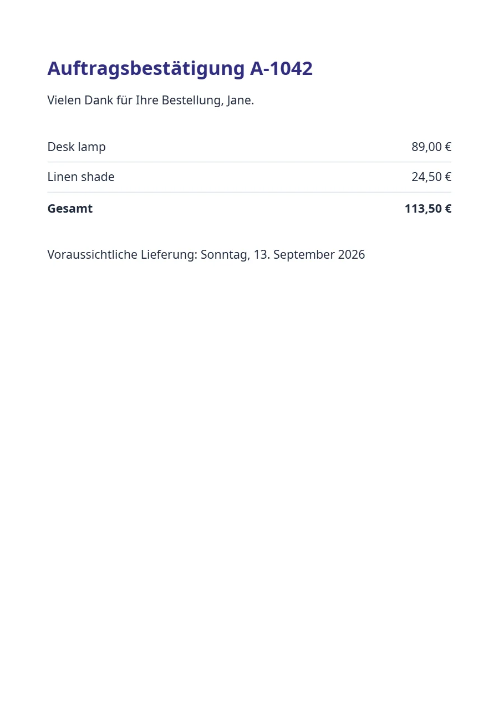

# One template, many languages

Texts come from the template’s dictionary through `t()`, and the request’s `locale` picks the language and the number and date formats. The German render says “Auftragsbestätigung” and “113,50 €”, the English one “Order confirmation” and “€113.50”, from the same data.

**Engine:** Jinja2 · **Output:** PDF · **Helpers:** `t`, `money`, `sum`, `date`, `dateAdd`

[See it on formfeed.dev](https://formfeed.dev/examples/multilingual?utm_source=github-templates&utm_content=order-confirmation) · [example-de.pdf](example-de.pdf) · [example-en.pdf](example-en.pdf)

## What this shows

- `i18n.json` holds one dictionary per language; `t('title', { number: order.number })` fills the `{number}` placeholder of the chosen one.
- The request’s `locale` decides everything at once: the dictionary, `money` (`113,50 €` or `€113.50`) and the long date that `date('PPPP')` prints.
- The data is the same for every language, so the caller never sends translated strings or formatted numbers.
- Without `locale` in the request, the template’s own setting (`en-GB`) applies.

## Files

| File | What it is |
| --- | --- |
| [`template.html`](template.html) | the template |
| [`style.css`](style.css) | its stylesheet |
| [`settings.json`](settings.json) | paper, margins and output settings |
| [`i18n.json`](i18n.json) | the label texts per language, for `t` |
| [`data/default.json`](data/default.json) | the sample data it was designed with |
| [`template.json`](template.json) | name, kind and engine, which `formfeed templates push` needs |

## Use it

- **Open it in a workspace.** [Use this template](https://app.formfeed.dev/en/examples/multilingual?utm_source=github-templates&utm_content=order-confirmation) puts a copy into your Formfeed workspace, published and ready for the API. A free account is enough, and it needs no CLI.
- **Copy it.** It is plain HTML and CSS with Jinja2 tags. The helpers (`t`, `money`, `sum`, `date`, `dateAdd`) are Formfeed's; the [helper reference](https://docs.formfeed.dev/templates/helpers) says what each does.
- **Push it into a Formfeed workspace** from the root of this repository, where `formfeed.json` is: `npx formfeed login`, then `npx formfeed templates push order-confirmation`. Open it in the editor to change it with a live preview.
- **Render it** from your code with the [API](https://docs.formfeed.dev/api/overview) and your own data, or try it first with `npx formfeed render order-confirmation`: renders with a test key are free.

MIT licensed, like the rest of this repository. [Formfeed](https://formfeed.dev/?utm_source=github-templates&utm_content=order-confirmation) is a PDF and image generation API with a free plan: 100 units a month, no card.
